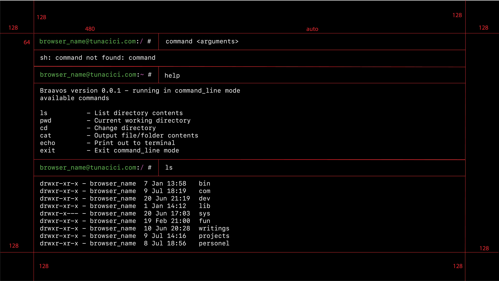
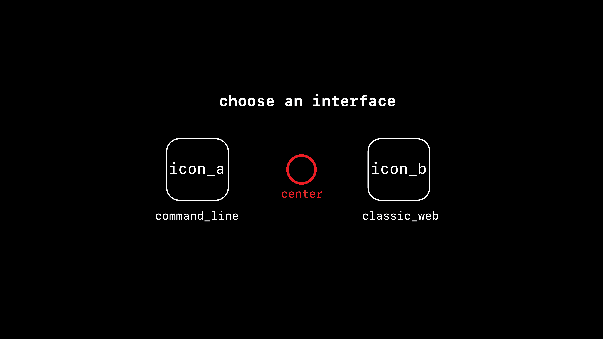

## Motivation
I wanted to create my **own** simple web page where I can _store_ my writings, projects and other stuff that I want people on the internet to discover >.<

> Most of my writings are published on Medium. However, I don't trust
> them enough to store all my writings. Call it paranoia if you will.

The name Braavos comes from the world of Game of Thrones. It is one of the most powerful and richest of the Free Cities[^1]. Tons of people from all over the _world_ visits it everyday. So, that's why
I named this project Braavos, so that people of the internet (world) can visit it Freely.

The project is Free to use by anyone. Feel free to fork, clone and do whatever you want.

Visit [tunacici.com](tunacici.com) to see it in action.

## Launcher



## Terminal

TODO: Finish the initial implementation before talking.

## Blog

TODO: Finish the initial implementation before talking.

## Build & Run

This is a React.js application. You can build / run it like any other app.

**0. Make sure you have `Node.js` installed**

Visit [Node.js Download page](https://nodejs.org/en/download) and install it.

**1. Clone this repository**

```bash
$ git clone https://github.com/TunaCici/Braavos.git
```

**2. Install the dependicies**

```bash
$ cd Braavos
$ npm install
```

**3. Start the application in _debug_ mode**

```bash
$ npm start
```

**4. Optionally _build_ it**

```bash
$ npm build
```

**5. Now go and explore everything!**

[1]: https://gameofthrones.fandom.com/wiki/Braavos

----
<div style="text-align: center;">
  
</div>

