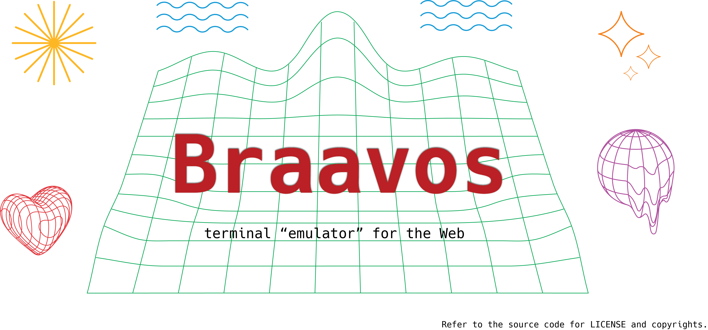
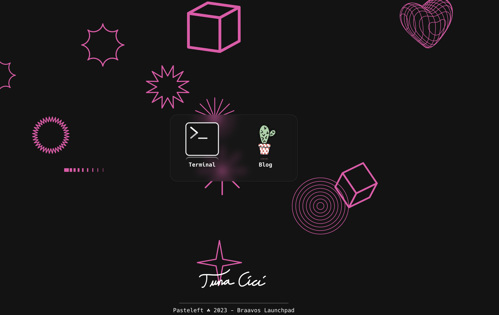
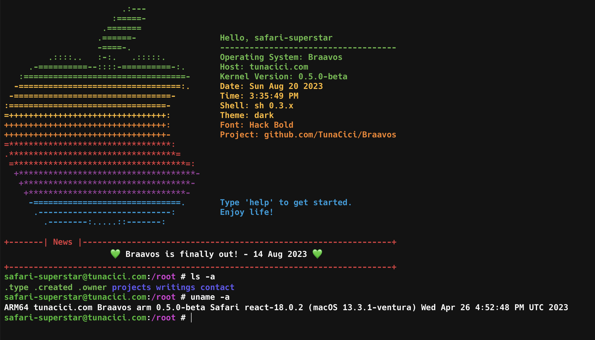
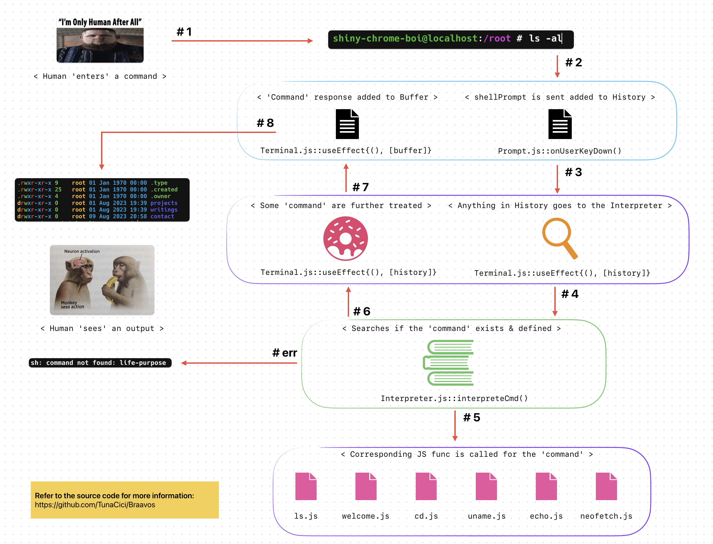
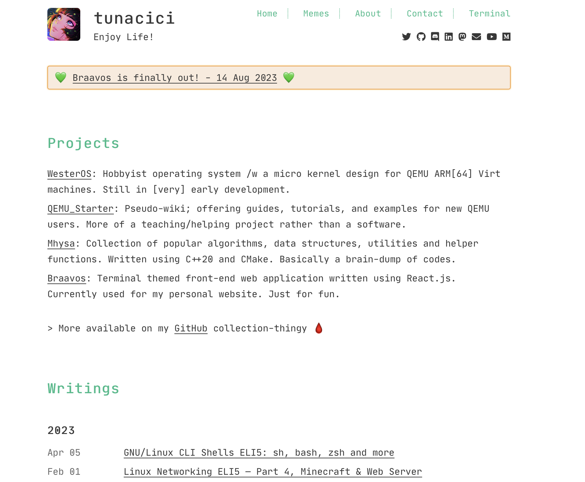

## Motivation
At first, I wanted to create my **own** simple web page where I can _store_ my writings, projects and other stuff that I want people on the internet to discover >.<

> Most of my writings are published on Medium. However, I don't trust
> them enough to store all my writings. Call it paranoia if you will.

Then I realized: _"What's the point of making something if it's not Unique™?"_ So, I went on and decided to make Braavos a terminal "emulator" for my Web app. It would have a CLI where you **type** to browse the website like in a classic terminal environment. However, I know that this is not the "de-facto" way to use the web. People want GUI not CLI!!! For that, I decided to keep my original plan as a sidekick.

Now the people have two options:

- **Option A.** Use Braavos for a "nerdy" CLI experience.
- **Option B.** Use Braavos_Blog for a more traditional blog.

The name Braavos comes from the world of [Game of Thrones](https://www.hbo.com/game-of-thrones). It is one of the most powerful and richest of the Free Cities[^1]. Tons of people from all over the _world_ visits the city everyday. So, that's why I named this project Braavos, so that people of the internet (world) can visit it Freely™.

The project is Free to use by anyone. It's licensed under the MIT license. Meaning, you are free to fork, clone and do whatever you want. 

**Visit [tunacici.com/](tunacici.com/) to see it in action.**

## Launchpad



This is the first thing you see when you launch Braavos. It is basically an app launcher (like you find in Android).

The background is an HTML canvas, where a randomly selected SVG images are displayed every few seconds. It looks rather "unprofessional" but who cares?

Depending on the option you choose, ReactJS will `<Route>` you to:

- **Terminal**: See the source code [src/modules/Terminal](https://github.com/TunaCici/Braavos/tree/main/src/modules/Terminal).
- **Blog**: See the external project [Braavos_Blog](https://github.com/TunaCici/Braavos_Blog).

## Terminal



The main purpose of this project. This is where you can "browse" the website using a CLI. I don't want to talk about it too much to spoil you. But, I will give an high-level view on how everything works.



I highly encourage you to read the source code. There are some interesting things that awaits you there. If you are:

- **A ReactJS developer**: You will cringe & want to burn this project to the ground.
- **Normal person**: You will not understand anything, but might impresed how "complex" the code is. (it is not)

> Maybe in the future we will have proper wiki for this project. 
>
> As for now: "No. I don't think I will." - Some random dude looking at a lake

## Blog



This one is for the people who don't want to use the CLI. It is a simple blog where I put my writings. I referenced [almost] everythinhg from [joonas.fi](https://github.com/joonas-fi/joonas.fi). The only thing I did was to change the content and some minor fixes & tweaks.

I forked the project and it now lives in [Braavos_Blog](https://github.com/TunaCici/Braavos_Blog) for more information about the **Blog**.

## Build & Run

This is a React.js application. You can build / run it like any other app.

**0. Make sure you have `Node.js` installed**

Visit [Node.js Download page](https://nodejs.org/en/download) and install it.

**1. Clone this repository**

```bash
$ git clone https://github.com/TunaCici/Braavos.git
```

**2. Install the dependicies**

```bash
$ cd Braavos
$ npm install
```

**3. Start the application in _debug_ mode**

```bash
$ npm start
```

**4. Optionally _build_ it**

```bash
$ npm build
```

**5. Now go and explore everything!**

[1]: https://gameofthrones.fandom.com/wiki/Braavos

----
<div style="text-align: center;">
  
</div>

